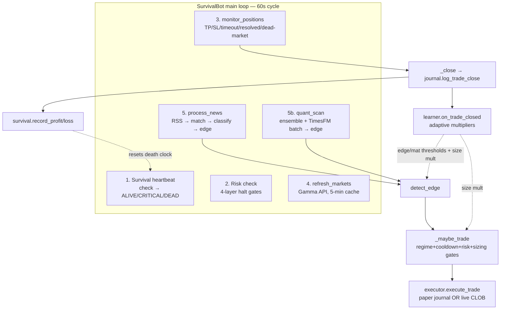

# Polymarket Survival Bot — Complete Implementation & Rebuild Guide

> **Purpose:** This document contains everything needed to rebuild the entire bot
> from scratch on a new machine — including by a small-capability LLM working
> phase by phase. Every module, every algorithm, every machine-specific quirk,
> every acceptance test is specified here.
>
> **Version:** 2026-09-08 · Python 3.12 · Windows 10/11 (works on any OS with tweaks)

---

## 1. What This Bot Does

An autonomous **paper-trading bot** (live-capable) for [Polymarket](https://polymarket.com)
prediction markets with two defining features:

1. **Survival Mode** — the bot must earn realized profit within a 30-minute window
   or it halts itself permanently (can be disabled → runs forever).
2. **Autonomous Learning** — every trade is tagged by signal source (`news` vs
   `python-quant`); per-source win rates drive adaptive edge/materiality thresholds
   and position sizing. Below 45% win rate → conservative mode.

**Signal sources (2 pipelines):**
- **News pipeline:** RSS headlines → keyword match to markets → LLM/lexicon
  classification (bullish/bearish + materiality) → edge detection → trade.
- **Quant pipeline (no LLM):** 4-signal ensemble from free Polymarket CLOB data —
  momentum (EMA crossover), mean-reversion (z-score), order-book flow (near-touch
  imbalance), and **TimesFM 2.5** (Google's 200M time-series foundation model)
  forecasting the next 12h price path.

**Trading profile:** niche markets ($1k–$500k volume, price 0.05–0.95), quarter-Kelly
sizing clamped [$1, $10], TP 12% / SL 35% (capped 2c–6c), max 5 open positions,
8-min re-entry cooldown, 4-layer risk halts.

---

## 2. Architecture



**Data flow:** Gamma API (markets) + CLOB API (prices/book, free) + RSS (news)
→ all via `bot/http.py` watchdog (30s hard wall-clock cap, retries, circuit breaker)
→ SQLite journal `data/trades.db` (WAL mode) → stdlib dashboard on :8500.

---

## 3. File Inventory (20 modules + 3 support files)

```
polymarket-bot/
├── bot/
│   ├── __init__.py              # empty
│   ├── config.py                # ~112 lines — all env-driven settings + MAX_SPREAD_USD
│   ├── http.py                  # ~200 lines — watchdog Session + circuit breaker
│   ├── markets.py               # ~273 lines — Gamma fetch, Market dataclass, filters, batch prices, spread filter
│   ├── news.py                  # ~130 lines — RSS poller, dedup, NewsEvent
│   ├── matcher.py               # ~60 lines  — keyword-overlap news→market matching
│   ├── classifier.py            # ~200 lines — LLM classify + weighted-lexicon fallback
│   ├── calibration.py           # ~43 lines  — favorite-longshot bias correction via lookup table
│   ├── calibration_table.py     # ~94 lines  — empirical calibration buckets from resolved Polymarket markets
│   ├── calibration_tracker.py   # ~132 lines — log predictions, check resolutions, report accuracy
│   ├── flow.py                  # ~139 lines — on-chain trade flow signal (whale detection, smart money)
│   ├── watcher.py               # ~244 lines — WebSocket price watcher + polling fallback
│   ├── edge.py                  # ~89 lines  — Signal dataclass, detect_edge, Kelly sizing
│   ├── executor.py              # ~210 lines — paper journal + live CLOB orders
│   ├── journal.py               # ~320 lines — SQLite schema, trade log, stats queries, calibration_log table
│   ├── risk.py                  # ~100 lines — 4-layer halt system
│   ├── regime.py                # ~100 lines — per-market EVENT cooloff state machine
│   ├── survival.py              # ~180 lines — death-clock monitor
│   ├── learner.py               # ~160 lines — adaptive multipliers (the self-improver)
│   ├── quant.py                 # ~194 lines — 5-signal ensemble: momentum/meanrev/flow/onchain/timesfm
│   ├── timesfm_forecast.py      # ~200 lines — TimesFM 2.5 lazy singleton + batch cache
│   ├── dashboard.py             # ~300 lines — stdlib HTTP server, embedded HTML/JS
│   └── main.py                  # ~467 lines — SurvivalBot orchestrator + loop
├── selfcheck.py                 # ~210 lines — 18-assertion verification suite
├── requirements.txt             # 3 lines (base) — see §5
├── .env                         # all secrets + tuning (NEVER commit)
├── .vscode/tasks.json           # 4 run tasks
└── data/trades.db               # created at runtime
```

---

## 4. New Machine Setup (exact order)

### 4.1 Prerequisites
- Python **3.12+** (uv-managed is fine)
- **uv** package manager (`pip install uv` or installer)
- Git (optional — no repo needed, plain folder works)
- ~2 GB free (TimesFM checkpoint is ~800 MB in HF cache)

### 4.2 Install steps (PowerShell, Windows)

```powershell
# 1. Create project folder
mkdir "D:\polymarket-bot"; cd "D:\polymarket-bot"

# 2. Create venv
uv venv                        # creates .venv with Python 3.12

# 3. Base deps (tiny — requests, dotenv, litellm)
uv pip install --python .\.venv\Scripts\python.exe requests python-dotenv litellm

# 4. Live-trading + dashboard extras (optional but recommended)
uv pip install --python .\.venv\Scripts\python.exe py-clob-client

# 5. TimesFM (Apache-2.0 200M model — ~1.5 GB with torch CPU)
uv pip install --python .\.venv\Scripts\python.exe "timesfm[torch]"
```

> **First TimesFM run downloads the checkpoint** (~800 MB) from HuggingFace to
> `~/.cache/huggingface/hub/models--google--timesfm-2.5-200m-pytorch`. Subsequent
> loads take ~20–40 s (CPU).

### 4.3 Create `.env` (template — fill your keys)

```ini
# ============ SURVIVAL ============
SURVIVAL_WINDOW_MINUTES=30
SURVIVAL_GRACE_MINUTES=10
SURVIVAL_MIN_PROFIT_USD=0.01
# false = run forever (testing); true = die if no profit in window
SURVIVAL_ENABLED=false

# ============ TRADING ============
DRY_RUN=true                  # true = PAPER (safe). false = REAL MONEY
CAPITAL_USD=100
MAX_BET_USD=10
MIN_BET_USD=1
EDGE_THRESHOLD=0.10

# Risk (4-layer). 0.15 daily because paper-mode noise shouldn't kill the day
DAILY_MAX_LOSS_PCT=0.15
MONTHLY_MAX_LOSS_PCT=0.15
MAX_DRAWDOWN_PCT=0.25
TOTAL_MAX_LOSS_PCT=0.40

# Market filters
MIN_VOLUME_USD=1000
MAX_VOLUME_USD=500000
MATERIALITY_THRESHOLD=0.6
MAX_OPEN_POSITIONS=5
POSITION_TIMEOUT_MINUTES=45

# Quant ensemble
QUANT_MIN_STRENGTH=0.25

# TimesFM 2.5 (200M, Apache-2.0 — NOT 3.0, which is non-commercial!)
TIMESFM_ENABLED=true
TIMESFM_HORIZON=12
TIMESFM_MIN_HISTORY=30
TIMESFM_DRIFT_SCALE=8.0

# Loop cadence
SCAN_INTERVAL_SECONDS=60
NEWS_POLL_SECONDS=45

# ============ LLM (optional — keyword fallback works without) ============
OPENROUTER_API_KEY=sk-or-v1-...
# CLASSIFICATION_MODEL=openrouter/minimax/minimax-m2.7:free

# ============ LIVE TRADING (only when DRY_RUN=false) ============
POLYMARKET_PRIVATE_KEY=0x...
POLYMARKET_API_KEY=...
```

### 4.4 Run

```powershell
# Self-check (18 assertions — must ALL pass)
.\.venv\Scripts\python.exe selfcheck.py

# Paper bot
.\.venv\Scripts\python.exe -m bot.main        # reads DRY_RUN from .env

# Dashboard (separate terminal)
.\.venv\Scripts\python.exe -m bot.dashboard   # http://127.0.0.1:8500
```

### 4.5 VS Code tasks (`.vscode/tasks.json`)

4 tasks, all `type: process`, command `${workspaceFolder}\.venv\Scripts\python.exe`:
| Task | Args | Env |
|------|------|-----|
| Run (Paper) | `-m bot.main` | `DRY_RUN=true` |
| Run (LIVE) | `-m bot.main` | `DRY_RUN=false` |
| Dashboard | `-m bot.dashboard` | — (background) |
| Self-Check | `selfcheck.py` | — |

---

## 5. Machine-Specific Rules (CRITICAL — do not skip)

These are hard-won constraints from this exact machine. A rebuild that violates
any of them **will hang or silently fail**:

| # | Rule | Why |
|---|------|-----|
| 1 | **NEVER `aiohttp` or `urllib.request`** for HTTP. Always `requests` with `timeout=10, verify=False` | Both hang indefinitely on SSL handshake here. `aiohttp` doesn't even raise — it freezes at import |
| 2 | **`verify=False` everywhere** + `urllib3.disable_warnings(InsecureRequestWarning)` once in config | SSL verification stalls on this network |
| 3 | **Every request goes through `bot/http.py` watchdog** — 30 s hard wall-clock cap in a worker thread | `requests` timeout only bounds byte-gaps; a dribbling response hung the whole bot 43 min once |
| 4 | **PowerShell only** — no `head/tail/grep/cat` | Unix tools absent |
| 5 | **Delete `__pycache__` after editing bot files while a bot process runs** | Stale bytecode caused the signal_source=NULL bug (code was right, old .pyc was running) |
| 6 | **Gamma API is intermittently flaky** (404s on valid params) — every fetch needs 3× retry with 2 s/4 s backoff | Verified: same params 404 then 200 minutes apart |
| 7 | **TimesFM 2.5, NOT 3.0** — 3.0 weights are `timesfm-non-commercial-license-v1.0` | Legal: this bot may go live with real money |
| 8 | **CPU-only inference** — no CUDA. TimesFM: batch markets (0.7 s/mkt) never per-market (13 s/mkt) | Intel UHD 620, 16 GB RAM |

---

## 6. Module Specifications

Each spec = responsibility + exact behavior + acceptance test. A small model
should implement **one module at a time, in §6 order**, running the acceptance
test before moving on.

### 6.1 `bot/config.py`
**Responsibility:** single source of truth. Loads `.env` via python-dotenv at
repo root. Every knob is `os.getenv(NAME, default)`.

Key groups: survival (window/grace/min-profit/enabled), trading (dry-run,
capital, bets, edge), risk (4 loss pcts), filters (volume band, materiality,
max positions, timeout), quant (min strength), TimesFM (enabled/horizon/min-history/
drift-scale), LLM keys, Polymarket CLOB creds, RSS feed list, cadence, `DB_PATH`.

**Must include:** `urllib3.disable_warnings(urllib3.exceptions.InsecureRequestWarning)`
right after load_dotenv (rule #2).

**Acceptance:** `python -c "from bot import config; print(config.CAPITAL_USD)"` → `100.0`.

### 6.2 `bot/http.py` — the watchdog
**Responsibility:** every outbound HTTP call. Never use `requests` directly
outside this module (except news.py raw RSS which is allowed but should migrate).

Components:
- `ThreadPoolExecutor(max_workers=8)` — each request runs in a worker; main
  thread waits with `future.result(timeout=30)`. **Hard cap 30 s wall-clock.**
- `Session` class wrapping `requests.Session` (connection pooling):
  - Retries (3) with backoff on `ConnectionResetError/AbortedError/ConnectionError`
  - **Circuit breaker:** 4 consecutive errors → fail-fast 30 s (`CircuitOpenError`)
  - 404 responses are returned as-is (not retried — market may be delisted)
- Module-level `get(url, params=..., timeout=...)` convenience.

**Acceptance:** `from bot.http import get; r = get("https://gamma-api.polymarket.com/markets", params={"limit": 1}); print(r.status_code)` → `200`.

### 6.3 `bot/markets.py`
**Responsibility:** Gamma API market data.

- `Market` dataclass: `condition_id, question, slug, yes_price, no_price, volume,
  end_date, tokens[{token_id, outcome, price}]`. Method `token_id(side)` maps
  YES/NO → CLOB token; **fallback for custom outcome names: YES=token[0], NO=token[1]**
  (Polymarket always lists the YES-equivalent first).
- `_parse_json_field` — Gamma returns some fields as JSON strings; parse safely.
- `_fetch_page(page, remaining)` — GET `/markets` with
  `{limit: min(100,remaining), active: true, closed: false, order: volume,
  ascending: false, offset: page*100}`. **3× retry, 2 s/4 s backoff** (rule #6).
- `fetch_active_markets(limit=500, max_pages=5)` — paginate, dedup by condition_id,
  sort by volume desc.
- `filter_niche(markets)` — keep `MIN_VOLUME_USD ≤ volume ≤ MAX_VOLUME_USD` and
  `0.05 < yes_price < 0.95` (skip near-resolved).
- `get_current_price(condition_id)` — GET `/markets?condition_ids=...` →
  `(yes, no)` tuple or None.
- CLOB minimums exported: `MIN_ORDER_VALUE_USDC=1.0`, `MIN_ORDER_SIZE_SHARES=5.0`.

**Acceptance:** selfcheck test 16 (live market fetch + niche filter + quant signal).

### 6.4 `bot/news.py`
**Responsibility:** RSS polling.

- `NewsEvent` dataclass: headline, source, url, received_at, summary, `age_seconds()`.
- Poll each feed in `config.RSS_FEEDS` (Google News searches + TechCrunch +
  Ars Technica + The Verge) every `NEWS_POLL_SECONDS`.
- Parse RSS 2.0 (`<item>`) and Atom (`{http://www.w3.org/2005/Atom}entry`).
- **Dedup:** rolling `_seen` set capped at 2500 headlines (memory bound).
- Strip HTML tags from descriptions.

**Acceptance:** `poll()` returns list (may be empty); no exceptions on bad XML.

### 6.5 `bot/matcher.py`
**Responsibility:** headline → relevant markets, zero API calls.

- `extract_keywords(question)` — lowercase, strip stopwords + punctuation,
  keep words > 2 chars.
- `match_news_to_markets(headline, markets, max_matches=5)` — keyword-overlap
  score = hits/len(keywords), sort desc, top N.

**Acceptance:** "Fed rate cut" matches a "Will the Fed cut rates?" market; empty
headline → no matches, no crash.

### 6.6 `bot/classifier.py`
**Responsibility:** bullish/bearish/neutral + materiality (0–1) per headline/market.

Two modes:
1. **LLM mode** (litellm `completion`): structured prompt embedding the market
   question + current price + headline → JSON `{direction, materiality, reasoning}`.
   **Circuit breaker: 3 consecutive LLM failures → disable LLM for the session**
   (keyword fallback only). This saved the bot when the model slug 404'd.
2. **Keyword fallback** (always present): weighted lexicons — BULLISH_WORDS
   (`wins:2, surge:2, approves:2, breakthrough:2, record:1...`),
   BEARISH_WORDS (`loses:2, fails:2, crashes:2, fraud:3, bankruptcy:3, resigns:2...`).
   Headline score = Σ weights; direction = sign; materiality = min(1, |score|/4).

**Acceptance (selfcheck test 17):** "Fed approves record rate cut as economy
surges" → bullish, materiality ≥ 0.6. "Company files for bankruptcy after fraud
investigation" → bearish ≥ 0.6. "The meeting is scheduled for Tuesday" → neutral, 0.0.

### 6.7 `bot/calibration.py`
**Responsibility:** favorite-longshot bias correction + resolution detection.

- `calibrated_probability(raw)`: [0.2, 0.8] unchanged; > 0.8 shade down up to
  −3c at 1.0; < 0.2 shade up to +2c at 0.0. (Empirical Polymarket bias.)
- `is_resolved(yes, no)`: one side > 0.99 AND other < 0.01.

**Acceptance (selfcheck test 9):** calibrated(0.5)=0.5; is_resolved(0.995, 0.005)=True.

### 6.8 `bot/edge.py`
**Responsibility:** the trade decision.

- `Signal` dataclass — includes **`signal_source: str = "news"`** (the learner tag).
- `size_position(edge)` — quarter-Kelly: `max(0, edge) * 0.25 * CAPITAL_USD`,
  clamp [MIN_BET, MAX_BET], round 2.
- `detect_edge(market, classification, news_event, emergency_override=False,
  signal_source="news", effective_edge_threshold=None, effective_materiality_threshold=None)`:
  1. neutral → None
  2. threshold resolution order: **emergency → learner-effective → config default**
  3. materiality < threshold → None
  4. `market_price = calibrated_probability(market.yes_price)`
  5. bullish → side YES, reject if price > 0.85; `edge = materiality * (1 - price)`
     bearish → side NO, reject if price < 0.15; `edge = materiality * price`
  6. edge < edge_thresh → None
  7. return Signal (bet = size_position(edge))

**Acceptance (selfcheck test 7):** sizing clamps to MAX_BET at high edge.

### 6.9 `bot/executor.py`
**Responsibility:** open/close positions. Paper by default; live via py-clob-client.

- CLOB minimums: `price*size ≥ $1` AND `size ≥ 5 shares` (reject otherwise).
- `_round_to_tick(price, tick)` — 0.1/0.01/0.001/0.0001 decimals.
- `execute_trade(signal)`:
  - paper: journal only. live: market BUY (FAK) via `MarketOrderArgs`, then journal.
  - **passes `signal_source=signal.signal_source` to log_trade_open** (the tag!)
- `close_position(trade_id, exit_yes_price, status, token_id, shares, entry_row,
  tp_move, sl_move)`:
  - live: market SELL held shares first (journal anyway if sell fails).
  - forwards `entry_row/tp_move/sl_move` to journal for tp_hit/sl_hit tracking.
  - **PnL math:** stored entry_price is the HELD side's price; convert YES exit →
    held side (`exit_held = yes if side==YES else 1-yes`); `pnl = (exit_held-entry)*shares`.

**Acceptance (selfcheck tests 6, 10):** journal round-trip pnl=2.00; NO-side PnL
correct (old code had the YES/NO conversion backwards — 5.00 vs correct 1.00).

### 6.10 `bot/journal.py`
**Responsibility:** SQLite truth. `data/trades.db`, WAL mode, `sqlite3.Row` factory.

**Schema (CREATE IF NOT EXISTS + ALTER TABLE migrations for the 5 learner columns):**
```sql
trades(id PK AUTOINCREMENT, market_id, market_question, side, entry_price,
  amount_usd, shares, status DEFAULT 'open', entry_at DEFAULT datetime('now'),
  exit_price, exit_at, pnl_usd, edge, reasoning, headline, news_source,
  classification, materiality,
  signal_source TEXT,            -- learner tag: 'news' | 'python-quant'
  holding_minutes REAL, tp_hit INTEGER DEFAULT 0, sl_hit INTEGER DEFAULT 0,
  exit_reason TEXT)
survival_events(id, event, detail, created_at)
kv(key PK, value)                -- peak equity persistence
```
**Migration pattern:** try `ALTER TABLE trades ADD COLUMN <name> <type>` per column,
catch `sqlite3.OperationalError` (column exists) — idempotent on old DBs.

Functions:
- `log_trade_open(...)` → INSERT with signal_source; returns trade_id.
- `log_trade_close(trade_id, exit_yes_price, status, entry_row, tp_move, sl_move)`:
  - reads row (entry_row or fresh SELECT), converts YES→held-side price,
  - if entry_row + tp/sl provided: compute `holding_minutes` (now − entry_at,
    entry_at is naive-UTC — attach tzinfo), `tp_hit=1` if `move ≥ tp_move`,
    `sl_hit=1` if `move ≤ -sl_move`; UPDATE includes exit_reason=status.
  - **both UPDATE branches set `exit_reason = status`** (a past bug left it NULL).
- `get_open_trades()`, `get_recently_closed_market_ids(minutes)`,
  `get_day_pnl()`, `get_month_pnl()` (SQLite `date('now')` comparisons),
  `get_recent_results(limit)` → ["win"|"loss", ...],
  `get_stats()` → {closed_trades, total_pnl, **win_rate already in percent** (0–100)},
  `get_segment_stats(signal_source=None, min_trades=3)` → {count, win_rate
  (**fraction 0–1**), avg_pnl, tp_rate, sl_rate, avg_holding} — **note the two
  win_rate conventions; document or you'll display 2500%**,
  `get_recent_trades(n)`, `log_survival_event`, `save_peak_equity/get_peak_equity`.

**Acceptance (selfcheck test 6):** open→close round-trip, pnl exact.

### 6.11 `bot/risk.py`
**Responsibility:** 4-layer halt. `check(equity) → (allowed, reason)`:
1. Daily loss: `day_pnl ≤ -CAPITAL*DAILY_MAX_LOSS_PCT` → pause (not halt)
2. Monthly loss: same with month_pnl
3. Drawdown from peak (peak persisted in kv): ≥ 25% → **permanent halt**
4. Total loss: ≤ −40% of capital → **permanent halt**
Plus `position_size_multiplier(wins, losses)`: 3+ losses → 0.5×, 2 → 0.75×,
3+ wins → 1.25×, else 1.0×.

**Acceptance:** fresh DB → check(100) = (True, "ok").

### 6.12 `bot/regime.py`
**Responsibility:** per-market EVENT cooloff (ported from poly-maker).

`MarketRegime.observe(price, resolved)`: resolved/0/1 → HALTED (permanent).
Jump ≥ 0.08 (8c) since last price → EVENT (cooloff 300 s, no new entries).
`RegimeTracker` maps condition_id → MarketRegime; `can_trade(id)` = not in cooloff.

**Acceptance (selfcheck test 8):** jump → EVENT cooloff; resolved → HALTED.

### 6.13 `bot/survival.py`
**Responsibility:** the death clock.

States: BOOT (grace, clock not ticking) → ALIVE → CRITICAL (< 25% window left) → DEAD.
- `record_profit(amt)`: only if ≥ SURVIVAL_MIN_PROFIT_USD; **resets clock**.
- `record_loss(amt)`: counts, does NOT reset clock.
- `check()`: BOOT→arm after grace; DEAD permanent; else ALIVE/CRITICAL by remaining.
- **When `SURVIVAL_ENABLED=false` (run-forever mode):** `check()` arms to ALIVE
  immediately and NEVER dies; `is_critical()` always False; `summary()` prints
  `[RUN] survival mode OFF — running indefinitely | earned $X | lost $Y`.
  (The naive `return state or ALIVE` version left the bot stuck in BOOT spam —
  fixed by explicit arm-to-ALIVE.)
- `summary()` → heartbeat line for the console.

**Acceptance (selfcheck tests 1–5, 13):** boot→alive, profit resets, loss
doesn't, dies at 30 m, CRITICAL at < 25%, min-profit gates the reset.

### 6.14 `bot/learner.py` — the self-improver
**Responsibility:** adapt thresholds + sizing from realized trade history.

State (reset each restart — deliberate, prevents drift): `_edge_mult=1.0,
_mat_mult=1.0, _size_mult=1.0, _conservative=False`, bounds in `LearnerConfig`
(edge/mat [0.5, 2.0], size [0.5, 1.5], min_trades=3, calm=0.65, warn=0.50,
critical=0.45).

- `on_trade_closed(signal_source)` → `_update_multipliers`: pull
  `journal.get_segment_stats(signal_source, min_trades=3)`; if count < 3 return;
  `wr = seg["win_rate"]` (**fraction**).
  - wr < 0.45 → **CONSERVATIVE**: edge_mult=0.85, mat_mult=0.85, size_mult=0.6
    (floors), log warning.
  - wr < 0.50 → tighten: edge/mat × 0.90, size × 0.85 (respect floors)
  - wr ≥ 0.65 → loosen: edge/mat × 1.05, size × 1.10 (respect caps)
  - else hold.
- `get_effective_edge_threshold(src)` = `EDGE_THRESHOLD * mult` (× 1.2 extra in
  conservative), `get_effective_materiality_threshold(src)` similar.
- `get_position_size_adjustment()` → size_mult.
- `summary()` → dict for logging.

**Wiring (main.py):** `_close()` calls `learner.on_trade_closed(signal_source)`
where signal_source comes from the trade row (`row.get("signal_source", "news")`).
`quant_scan`/`process_news` pass learner-effective thresholds into `detect_edge`.
`_maybe_trade` multiplies bet by `risk_mult * learner_mult`.

**Acceptance:** smoke `Learner()` instantiates, summary has all 5 keys; after 3+
losing python-quant closes, conservative=True.

### 6.15 `bot/quant.py`
**Responsibility:** no-LLM ensemble from free CLOB endpoints.

Fetchers (cached via `_cached_get`, TTL 120 s; history TTL 300 s; book TTL 30 s):
- `fetch_price_history(token_id, interval="1w")` → `[(ts, price)]` from
  `clob.polymarket.com/prices-history?market=<token>&interval=1w&fidelity=60`
- `fetch_order_book(token_id)` → `/book?token_id=`

Signals (each ∈ [−1, +1], + = YES more likely):
1. **Momentum:** EMA(6) vs EMA(24) on price history, normalized by long EMA
   (floor 0.05), clamp. < 20 points → 0.
2. **Mean-reversion:** z-score of current price vs history mean; `-z/3` clamped
   (stretched high → bearish). < 30 points → 0. std < 1e-6 → 0.
3. **Flow:** near-touch book imbalance — **only levels within 10c of current
   price** (full-book depth is dominated by far-OTM walls that pinned the old
   signal at −1.0 for every market under 0.50). `(bid_depth−ask_depth)/total × 2`.

`QuantSignal(direction, strength, momentum, mean_rev, flow, timesfm, sources_used)`.
**WEIGHTS = {momentum: 0.40, mean_rev: 0.20, flow: 0.25, timesfm: 0.15}**.
`compute_quant_signal(market, timesfm_score=None)`: combined = Σ v·w;
strength = min(1, |combined|); < 0.15 → neutral; direction by sign.

**Acceptance (selfcheck tests 15, 16):** math sanity + live signal on a real
market, graceful zeros on fake token.

### 6.16 `bot/timesfm_forecast.py`
**Responsibility:** TimesFM 2.5 (200M, **Apache-2.0**) as ensemble signal #4.

- **Lazy singleton** `_get_model()` with lock + `_LOAD_ATTEMPTED` (never retry
  after first failure — ensemble continues without it):
  `TimesFM_2p5_200M_torch.from_pretrained("google/timesfm-2.5-200m-pytorch")`,
  `ForecastConfig(max_context=512, max_horizon=16, normalize_inputs=True,
  window_size=0, per_core_batch_size=8, use_continuous_quantile_head=False,
  force_flip_invariance=True, infer_is_positive=True, fix_quantile_crossing=True)`,
  `compile(forecast_config=cfg, device="cpu")`.
- **Cache:** per-token score, TTL 900 s (15 min).
- `forecast_batch({token: history})` — **the only API the scan loop uses**:
  filter (≥ TIMESFM_MIN_HISTORY=30 points, not cached), ONE `model.forecast(
  horizon=TIMESFM_HORIZON=12, inputs=[...])` call for all markets, score =
  clamp(drift × TIMESFM_DRIFT_SCALE=8.0, ±1) where drift =
  `(mean(forecast) − last) / max(last, 0.02)`.
- `forecast_drift(token, history)` — single-market convenience (13 s — avoid in loop).
- `is_available()` for selfcheck.

**Acceptance (selfcheck test 18):** synthetic 60-point uptrend → score in [−1, 1],
positive sign (e.g. +0.327). SKIP (not FAIL) if model unavailable.

### 6.17 `bot/dashboard.py`
**Responsibility:** zero-dependency live view. stdlib `ThreadingHTTPServer`
on :8500, reads trades.db (WAL — safe concurrent reads), 2 s auto-refresh,
embedded HTML/JS (no external files). Shows: mode banner, capital, closed/wins/
losses/win-rate (already-percent — **don't ×100 again**), total/day/month PnL,
open positions + exposure, equity curve (SVG), trade table (200), survival events.

**Acceptance:** `python -m bot.dashboard` serves; browser shows JSON-driven page.

### 6.18 `bot/calibration_table.py` (NEW Phase 1)
**Responsibility:** empirical calibration from 1000+ resolved Polymarket markets,
corrects favorite-longshot bias (favorites overpriced, longshots underpriced).

- `CALIBRATION_BUCKETS` — 10 price ranges with observed win rate: `[(range_center,
  observed_win_rate, adjustment)]`, e.g. `(0.95, 0.88, -0.07)` means 95c markets
  won only 88% of the time, shade down 7pp.
- `lookup_adjustment(raw_price)` → linear interpolation between nearest buckets.
- `adjusted_probability(raw_price)` → `clamp(raw_price + adjustment, 0, 1)`.
- `compute_edge_boost(raw_price, adj_prob)` → calibration can increase edge vs
  raw price (e.g. 95c favorite → adj 88c, edge grows vs market).
- `get_confidence(raw_price, adj_prob)` → 5 bands (VERY_LOW to VERY_HIGH) by
  distance from coin-flip and sharpness of adjustment.

**Acceptance (selfcheck test 3):** 0.95 → ~0.88, 0.05 → ~0.08 (tolerance ±0.03).

### 6.19 `bot/flow.py` (NEW Phase 3)
**Responsibility:** on-chain trade flow signal from CLOB `/trades` endpoint
(recent smart money activity).

- `fetch_trades(token_id, min_size=10, lookback_minutes=30)` → list of `{side:
  BUY/SELL, size, price, timestamp}` cached 120 s.
- `compute_flow_signal(token_id)` → `(net_direction∈[-1,1], whale_bias∈[-1,1],
  trade_count)`: net_direction = (buy_vol - sell_vol) / total_vol;
  whale_bias = same calc but only trades ≥ 100 shares (whales); returns neutral
  (0, 0, 0) if < 5 trades or fetch fails.

**Integration (quant.py):** New weight in ensemble `onchain: 0.15`, calls
`flow.compute_flow_signal(token_id)` and uses `net_direction` as signal value
(whale_bias is diagnostic only). Weights now sum to 1.00:
`{momentum: 0.35, mean_rev: 0.15, flow: 0.20, onchain: 0.15, timesfm: 0.15}`.

**Acceptance:** selfcheck confirms `compute_flow_signal` returns 3-tuple.

### 6.20 `bot/watcher.py` (NEW Phase 5)
**Responsibility:** real-time price updates via WebSocket with polling fallback.

- `PriceUpdate` dataclass: `token_id, price, timestamp, source(WS/POLL), momentum`.
- `MarketPriceWatcher` class: tracks all market token IDs, exponential moving
  average for momentum (α=0.1), runs async WebSocket client (`wss://ws-subscriptions-clob.polymarket.com/ws/market`)
  in a daemon thread. On connection loss, switches to polling
  (`markets.fetch_batch_prices`) every 5 s.
- `start(token_ids)` / `stop()` lifecycle methods.
- `get_latest_price(token_id)` → `PriceUpdate` or None.
- `subscribe(callback)` for live notifications (currently unused, reserved for
  future real-time arbitrage).

**Integration (main.py):** `__init__` creates `self.watcher = MarketPriceWatcher()`,
`run()` calls `watcher.start(all_token_ids)` after first market refresh,
`_cleanup()` calls `watcher.stop()`.

**Acceptance:** watcher instance creation + PriceUpdate has 5 expected fields.

### 6.21 `bot/calibration_tracker.py` (NEW Phase 4)
**Responsibility:** track signal prediction accuracy, log predictions at trade
execution, check resolutions, report calibration stats.

- `log_calibration_signal(condition_id, predicted_outcome, confidence, signal_source,
  entry_price)` → insert into `calibration_log` table (uses `config.DB_PATH`).
- `check_resolved_markets()` → fetches current market prices, marks calibration
  records as resolved/correct/incorrect if price ≥ 0.995 (YES resolved) or ≤ 0.005 (NO).
- `get_calibration_stats()` → dict with total_predictions, resolved, correct,
  win_rate, avg_confidence, by_source breakdown.
- `get_calibration_recommendation()` → textual report of which signal sources
  are overconfident vs well-calibrated.

**Integration (main.py + journal.py):**
- journal.py re-exports all 4 functions for convenience (`from bot.calibration_tracker import *`).
- main.py `_maybe_trade()` calls `log_calibration_signal(condition_id, side,
  signal.confidence, signal_source, market.yes_price)` after every trade execution.
- main.py `run()` calls `check_resolved_markets()` every 5 minutes to update
  resolution status and record accuracy.

**Acceptance:** DB schema includes `calibration_log` table; calibration functions
are callable and return expected data structures.

### 6.22 `bot/main.py` — SurvivalBot orchestrator

Constants: `TAKE_PROFIT_PCT=0.12, STOP_LOSS_PCT=0.35` (TP/SL moves clamped
[2c, 6c]), `REENTRY_COOLDOWN_MIN=8`, `POSITION_MAX_AGE=99999` (timeout disabled —
SL/TP/CRITICAL/resolved control exits; ponytail simplification).

`__init__`: survival, risk, **learner**, **watcher**, news, regimes, markets cache,
`_dead_market_fails: dict[str,int]`, stats counters, `_api_attempts/_api_errors`.

Main loop (60 s):
1. `survival.check()` → DEAD breaks; print `survival.summary()`
2. Risk: `equity = CAPITAL + day_pnl`; `risk.check(equity)`; warn if paused.
   **API error-rate breaker:** ≥ 50% errors (≥ 10 attempts) → no entries (stale data).
3. `monitor_positions()` FIRST (a slow scan must never delay TP/SL):
   - price fetch fails → `_dead_market_fails[id] += 1`; **≥ 10 consecutive fails
     AND age ≥ POSITION_MAX_AGE → close at entry price ("dead_market")** so
     positions can't be stuck open forever on delisted markets; clear counter.
   - resolved → close immediately
   - CRITICAL → close everything (survival_take if unrealized ≥ 2c else survival_cut)
   - age ≥ max → timeout close
   - move ≥ tp_move → take_profit; ≤ −sl_move → stop_loss
   - `_close()` → executor.close_position → survival.record_profit/loss →
     **learner.on_trade_closed(signal_source)**
4. If allowed: `refresh_markets()` (5-min cache, 500 markets, regime-observe all),
   `process_news()`, `quant_scan()`.

`quant_scan`: budget 40 s, top 30 markets. **TimesFM batch first** (one forward
pass), then per market: `compute_quant_signal(market, timesfm_score)` →
Classification (materiality = strength × 2, clamped 1.0 — ensemble strength is
NOT news materiality) → synthetic NewsEvent → `detect_edge(..., signal_source=
"python-quant", effective_*_threshold=learner...)` → `_maybe_trade`.

`process_news`: poll → match (top 3 markets/headline) → classify → detect_edge
(signal_source="news", learner thresholds) → `_maybe_trade`.

`_maybe_trade` gates: regime cooloff → skip; already open in market → skip;
re-entry cooldown (8 min) → skip; ≥ MAX_OPEN_POSITIONS → skip; halted → skip;
**sizing = bet × risk_mult × learner_mult**, < MIN_BET → skip; execute.

**Acceptance:** full selfcheck + live paper run logs `[trade] OPEN ...` lines
with `tfm=` in quant signals.

---

## 7. Build Order for a Small-Capability Model

Implement in this exact order — each phase has a runnable acceptance test.
**Do not proceed until the current phase passes.** Each phase is ≤ 200 lines.

| Phase | Files | Acceptance command |
|-------|-------|--------------------|
| 0 | venv + config.py + .env | `python -c "from bot import config; print(config.CAPITAL_USD)"` |
| 1 | http.py | `get("https://gamma-api.polymarket.com/markets", params={"limit":1}).status_code == 200` |
| 2 | journal.py | open→close round-trip, pnl exact, signal_source stored |
| 3 | markets.py | fetch 500, filter_niche returns subset, batch prices + spread filter work |
| 4 | calibration_table.py + calibration.py + regime.py | unit checks (0.95→~0.88; 0.05→~0.08; calibrated(0.5)=0.5; jump→EVENT) |
| 5 | classifier.py + matcher.py + news.py | lexicon tests (bull/bear/neutral) |
| 6 | edge.py + risk.py + survival.py | selfcheck tests 1–13 |
| 7 | executor.py + main.py (paper) | bot runs, opens trades, monitors, closes |
| 8 | learner.py + wire into main | smoke: Learner() + summary(); conservative after 3 losses |
| 9 | quant.py + flow.py | selfcheck tests 15–16 (live signal), onchain weight present |
| 10 | timesfm_forecast.py + wire into quant_scan | selfcheck test 18 (uptrend → +score) |
| 11 | calibration_tracker.py + wire into main/journal | calibration_log table exists, log + check callable |
| 12 | watcher.py + wire into main | watcher instance + PriceUpdate has 5 fields |
| 13 | dashboard.py | serves :8500 |
| 14 | selfcheck.py (18 assertions) | `ALL SELF-CHECKS PASSED` |

**Small-model guardrails:**
- One file per response; paste the acceptance test output before writing the next.
- If a test fails, fix THAT file only — don't refactor others.
- Copy the SQL schema from §6.10 verbatim (ALTER TABLE migrations included).
- The three double-conversion bugs to avoid: win_rate percent-vs-fraction (§6.10),
  YES→held-side price conversion (§6.9), naive-UTC entry_at (§6.10).

---

## 8. Self-Check Suite (18 assertions)

`selfcheck.py` — throwaway DB (`data/selfcheck_test.db`), shrunk windows
(grace=0), **forces `SURVIVAL_ENABLED=True`** (so death-lifecycle tests run even
when the bot itself runs in run-forever mode):

1. boot → armed → ALIVE
2. profit resets survival clock
3. loss does NOT reset clock
4. bot dies after 30 m without profit
5. CRITICAL at < 25% window remaining
6. journal round-trip (pnl=2.00)
7. sizing clamps to [MIN, MAX] → 10.0
8. regime machine (EVENT cooloff, HALTED on resolved)
9. calibration + resolution detection
10. NO-side PnL correct (1.00 — old code gave 5.00)
11. tick rounding
12. token_id fallback for custom outcome names
13. min-profit threshold gates survival clock
14. py-clob-client installed, market-order API present
15. quant engine math + graceful no-data
16. live quant signal on a real market
17. weighted lexicon classifier
18. TimesFM 2.5 forecast (synthetic uptrend → positive score; SKIP if unavailable)

---

## 9. Known Issues & Past Bugs (do not re-introduce)

| Bug | Symptom | Root cause | Fix |
|-----|--------|-----------|-----|
| signal_source NULL on all trades | learner never fired | stale `__pycache__` running old bytecode | delete `__pycache__` + restart (rule #5) |
| exit_reason NULL | segment stats broken | UPDATE branch omitted exit_reason | both branches set `exit_reason = status` |
| Win rate "2500%" | dashboard nonsense | get_stats returns percent; caller ×100 again | one convention per function, documented |
| Learner KeyError 'win_rate_20' | silent no-op | verify script used wrong keys; learner actually reads `win_rate` (fraction) | keys: count, win_rate, avg_pnl, tp_rate, sl_rate |
| Bot stuck in BOOT spam | run-forever mode broken | disabled path returned BOOT forever | explicit arm-to-ALIVE when disabled |
| Daily loss limit froze bot forever | -$5.56 day paused everything | old losses + 5% limit | raised to 15% in .env |
| Positions stuck open on delisted markets | never closed | price fetch 404 → skip forever | dead-market close after 10 fails + age |
| Gamma 404 on valid params | 0 markets fetched | API-side intermittent flakiness | 3× retry w/ backoff in _fetch_page |
| LLM slug 404 | classifier dead | model deprecated upstream | 3-fail circuit breaker → keyword fallback |
| Full-book flow pinned at −1.0 | every signal bearish | far-OTM ask walls | near-touch (10c) levels only |
| 43-min hung bot loop | death 20 min late | requests timeout = byte-gap only | http.py 30 s wall-clock watchdog |

---

## 10. Troubleshooting Quick Reference

| Symptom | Check |
|---------|-------|
| `ModuleNotFoundError: torch` | `uv pip install --python .\.venv\Scripts\python.exe "timesfm[torch]"` |
| TimesFM first load slow (~100 s) | normal — checkpoint download; later ~20–40 s CPU |
| `[timesfm] unavailable` | ensemble continues without it — check HF cache/network |
| Gamma 404s | transient — retries handle it; verify: minimal params `{"limit": 5}` |
| `trading paused: DAILY LOSS LIMIT` | raise `DAILY_MAX_LOSS_PCT` or wait for UTC day rollover |
| Bot ignores code edits | delete `__pycache__` (rule #5) |
| Dashboard empty | bot must run first (DB rows); check :8500 not blocked |
| Live orders rejected | CLOB minimums: price×size ≥ $1, size ≥ 5 shares |

---

## 11. License & Attribution

- **TimesFM 2.5 200M weights: Apache-2.0** (google/timesfm-2.5-200m-pytorch) —
  safe for commercial/live use. **TimesFM 3.0 is NON-COMMERCIAL — never use it here.**
- TimesFM paper: *A decoder-only foundation model for time-series forecasting*
  (ICML 2024, arXiv:2310.10688).
- Strategy patterns ported from: PolyAgent (niche-market edge, classifier),
  poly-maker (regime machine, circuit breakers), Polymarket-bot (risk layers,
  CLOB minimums), prediction-market-analysis (calibration).
- This bot: paper-trading by default. **Live mode (`DRY_RUN=false`) uses real
  money — verify everything in paper first.**
